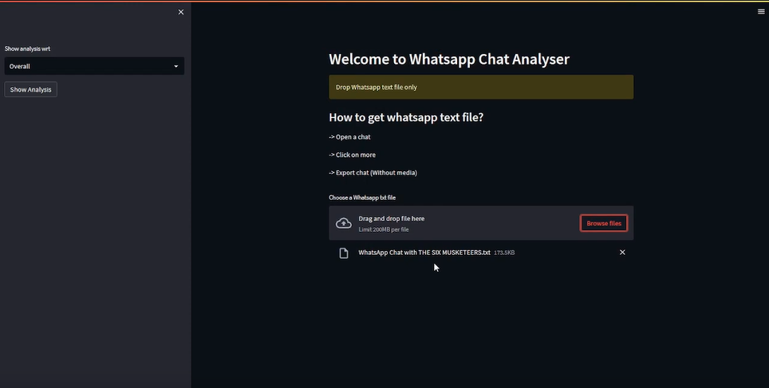

# Whatsapp Chat Analyzer

Unveil WhatsApp chat insights effortlessly with this Python and Streamlit-powered analyzer. Track messages, media, and links shared. Explore busy days and months, spot active users, and map weekly engagement. Elevate your chat understanding today

## :computer: Live

## Watch the live demo here: https://youtu.be/IhjdrB9r-qE

## :rocket: Highlights

- **Overall Group Analysis:** Summarize the key statistics of the group's messaging behavior, like average messages per day, most active participants, and more.
- **Single Participant Analysis:** Feature a detailed analysis of a single participant's messaging behavior, including metrics like messages sent per day, most active hours, and average message length.
- **Engagement Trends:** Highlight any trends in engagement over time, such as spikes in activity during certain events or topics.
- **Monthly Trends:** Showcase which months had the highest and lowest message counts, helping users identify periods of intense communication.

## :zap: Features

- Most Active User Analysis
- Monthly Timeline and Most Busy Month
- Weekly Activity Map
- Media and Links Shared 

##  :open_file_folder: Project Structure

- `app.py`: Frontend orientation of the application.
- `preprocessor.py`: Preprocesses Excel data for streamlined analysis, ensuring data readiness for insightful interpretation.
- `helper.py`: Encompasses data analysis functions tailored for WhatsApp chat insights.

## :computer: Tech Stack 

- **Frontend:** Stremlit Framework
- **Backend:** Python
- **Libraries Used:** Matplotlib and Seaborn to Visualize data, pandas and regex

## :bulb: Future Enhancements

- **Keyword Search:** Allow users to search for specific keywords and display the messages containing those keywords.
- **Integration with Other Platforms:** Extend the analyzer to support other messaging platforms like Telegram, Facebook Messenger, etc.
- **Interactive Filters:** Implement interactive filters to allow users to select a specific date range or participant and see analytics for that subset of the chat.
- **Topic Clustering:** Use topic modeling techniques to automatically group messages into topics, making it easier to understand the main subjects being discussed.
- **Export Reports:** Allow users to export the generated reports and visualizations for their own records or share them with others.
- **Geolocation Data:** If users have shared location data, you can visualize where most of the participants are located on a map.
- **Data Privacy Features:** Ensure that sensitive information is handled appropriately and allow users to mask or exclude specific parts of the chat.
- **Real-time Analysis:** Develop a mechanism to analyze messages in real-time as they come in, providing live insights for ongoing conversations.

## :muscle: Contributions

Contributions are welcome! Feel free to open issues for discussion or submit pull requests to enhance the application's functionality and accuracy. Here is how you can contribute.

- **Feature Enhancements:** If you have ideas for new features, improved data visualization, or advanced prediction algorithms, open an issue to discuss your suggestions.

- **Bug Fixes:** If you encounter any bugs or unexpected behavior while using the application, submit detailed bug reports or pull requests to address the issues.

- **Deployment Expertise:** I am seeking help to streamline the deployment process. If you have experience with deploying web applications, your insights would be invaluable in making the application accessible to a wider audience.

To contribute, fork this repository, create a new branch for your work, make your changes, and submit a pull request. Let's collaborate to make this application even more powerful and user-friendly!

## :page_facing_up: License

This project is licensed under the [MIT License](LICENSE).

Built with :heart: by Arunim Malviya
